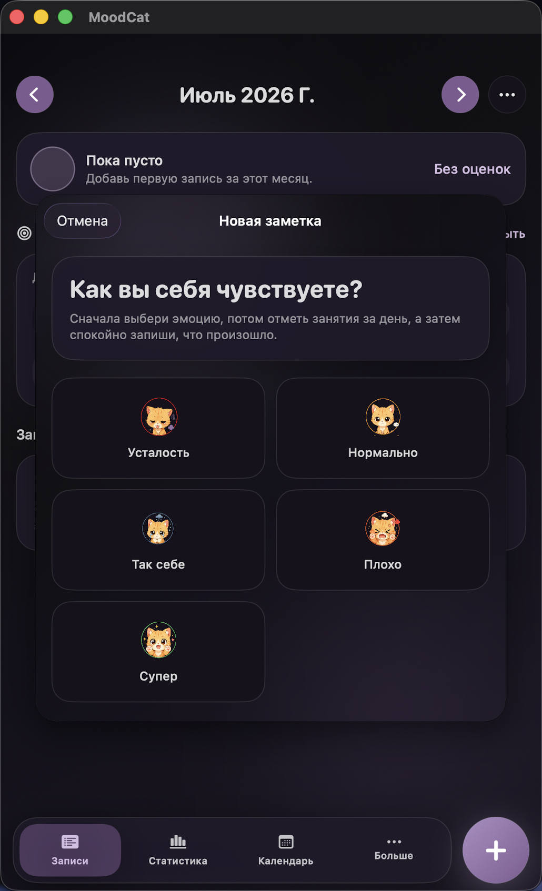
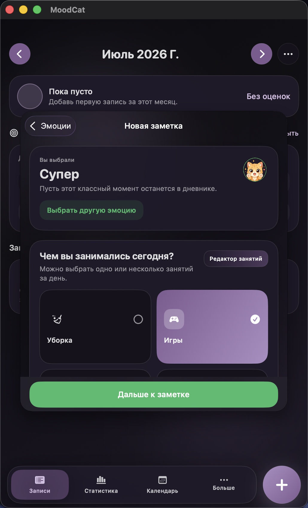
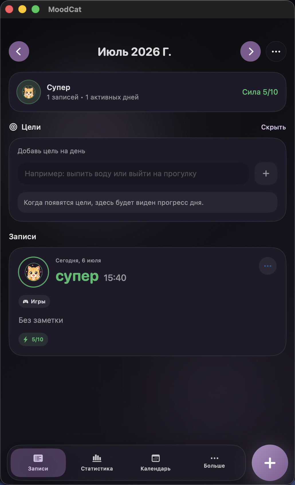
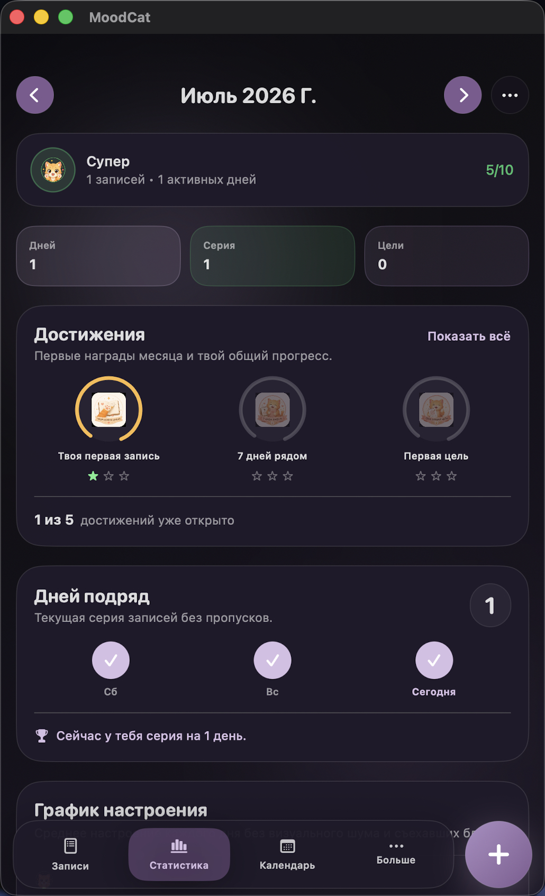

# Felix

Felix is a cozy iOS emotion diary built with `SwiftUI`. The app helps users track daily mood, write short notes, manage personal goals, review emotional patterns on a calendar, and customize the experience with cat-themed visuals.

This project was built as a portfolio app and as a real product prototype, so it mixes UI polish, local persistence, premium flows, personalization, and cloud-ready architecture.

## Screenshots

<p align="center">
  
  
</p>
<p align="center">
  
  
</p>

## Highlights

- Mood journal with quick daily check-ins
- Note composer with custom activities and mood stickers
- Daily goals with completion tracking
- Calendar and statistics screens for reviewing patterns over time
- Achievements system with collectible cat badges
- Theme switching and mood sticker theme customization
- Russian, Ukrainian, and English localization
- Local reminders for journaling
- Premium subscription flow powered by `StoreKit 2`
- Account and cloud sync architecture with `Firebase Auth` and `Firestore`

## Tech Stack

- `SwiftUI` for the full interface
- `SwiftData` for local persistence
- `Firebase Authentication` for Google / Apple sign-in flows
- `Cloud Firestore` for cloud sync
- `StoreKit 2` for premium access
- `UserNotifications` for daily reminders
- `ActivityKit` groundwork for Live Activity features

## Project Structure

```text
felix228/
├── App/                # App entry point and app-wide environment objects
├── Core/               # Shared models, localization, theme system
├── Features/           # Screens and feature modules
│   ├── Activities/
│   ├── Achievements/
│   ├── Home/
│   ├── Journal/
│   ├── Mood/
│   ├── Premium/
│   ├── Settings/
│   └── Shell/
├── Resources/          # Assets, icons, achievements, sticker artwork
└── Services/           # Firebase and sync services
```

## Main Features

### 1. Emotion Diary
Users can create entries with:

- one of five moods
- optional activities
- optional note about the day
- goal completion context

### 2. Goals

- Create personal daily goals
- Mark them complete for a specific day
- Review completion progress in the app

### 3. Calendar and Statistics

- Browse entries by month
- Filter calendar review by moods, activities, or goals
- Track overall patterns through summary cards and counters

### 4. Personalization

- App themes: system, light, dark, green, and premium color themes
- Mood sticker themes: classic and premium packs
- Multi-language support with automatic language detection from iPhone settings

### 5. Premium Layer

Premium unlocks:

- extra color themes
- extra sticker packs
- subscription-ready architecture for future features

For local development, the project includes a `StoreKit` configuration file for testing subscription flows in Xcode.

## Portfolio Value

This app demonstrates:

- modular SwiftUI architecture
- state management with shared environment objects
- local + cloud data thinking
- localization and theming
- subscription UX
- custom visual system and product polish

## How to Run

1. Open `felix228.xcodeproj` in Xcode.
2. Select the `felix228` scheme.
3. If you want cloud auth and sync, add your own Firebase config as `felix228/Config/GoogleService-Info.plist`.
4. Use `felix228/Config/GoogleService-Info.example.plist` as the safe template for that file.
5. Run on Simulator or device.

For premium testing, the scheme is configured to use the bundled `StoreKit` configuration.

## Notes

- The public repository does not include the real `GoogleService-Info.plist` for security reasons.
- To enable Firebase locally, create your own `felix228/Config/GoogleService-Info.plist` from the example file and your Firebase project.
- Some cloud features depend on local Firebase configuration.
- The UI, assets, and product direction were iterated as part of a personal design-and-development workflow.

## Author

Dasha Stepanova
